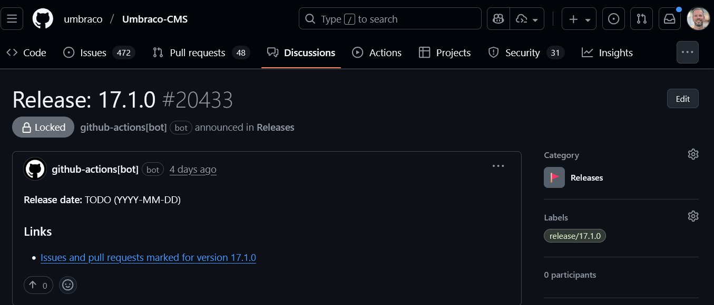

# Releases Management Guide

This guide explains how Umbraco CMS releases are tracked and displayed on the Community Site.

## How Release Discussions Are Created

Release discussions are automatically created through a [GitHub Action workflow](https://github.com/umbraco/Umbraco-CMS/blob/main/.github/workflows/label-to-release-announcement.yml) that runs hourly in the Umbraco CMS repository.

**How it works:**

1. The workflow scans all issues and pull requests updated in the last 24 hours
2. When it finds a new label starting with `release/` (e.g., `release/16.1.0`), it automatically:
   - Creates a new discussion in the "Releases" category
   - Adds a template body with placeholder information
   - Locks the discussion to prevent replies
   - Tags the discussion with the corresponding release label

3. A notification is sent to the `#cms-release-announcements` Slack channel



## Updating Release Information

Once a release discussion is created, the release manager should update the following information:

### Required: Release Date

Find the line in the discussion body:
```
**Release date:** TODO (YYYY-MM-DD)
```

Update it with the actual or planned release date:
```
**Release date:** 2024-12-15
```

### Optional: LTS Status (Major Versions Only)

For major version releases, you can mark whether it's a Long Term Support (LTS) release. Add the line:

```
**Long term supported version?** Yes
```

**Note:** This field is only needed for major versions. If the new major is not an LTS, no need to add anything.

## Adding Release Description

Before the `## Links` section in the discussion body, you can add a description for the release. This is a great place to:

- Summarize key features and improvements
- Link to relevant documentation
- Include blog post announcements
- Add links to unboxing videos or community content
- Highlight breaking changes or upgrade notes

**Example:**

```markdown
Umbraco 16.1.0 brings exciting new features including...

Check out these resources:
- [What's New in 16.1](https://umbraco.com/blog/whats-new-161)
- [Upgrade Guide](https://docs.umbraco.com/umbraco-cms/fundamentals/setup/upgrading)
- [Community Unboxing Video](https://www.youtube.com/watch?v=...)

## Links
...
```

**Note:** The `### Links` section at the bottom is only for the people who stumble upon the discussion on GitHub, it won't appear on releases.umbraco.com

## How the Community Site Uses This Data

The Community Site automatically syncs release discussions, and updates to issues and PRs **every hour, on the hour**. 

The Discussion is where any manual content for a version goes, the release date, LTS status and a description if needed. 

## TODO

The following things are still on the roadmap:

- [ ] Ability to trigger a manual sync of the data so release managers don't have to wait an hour
- [ ] Responsive layout for usability/readability on mobile
- [ ] A better way to keep the chosen version (or versions, in case of a compare ) in view while you're scrolling the list
- [ ] A better page header with a background color so you can see the nav bar better 
- [ ] Better logo
- [x] ~~Filter out RC relesases by default, they're not relevant when a version has been released; however in the compare you can toggle "Also show pre-releases"~~
- [ ] When a final version has not been released but pre-releases are available, show an indicator on the Home/Latest page